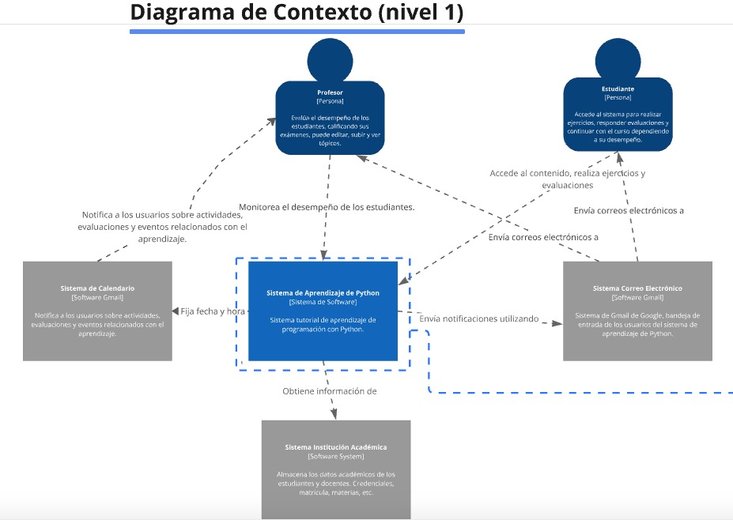
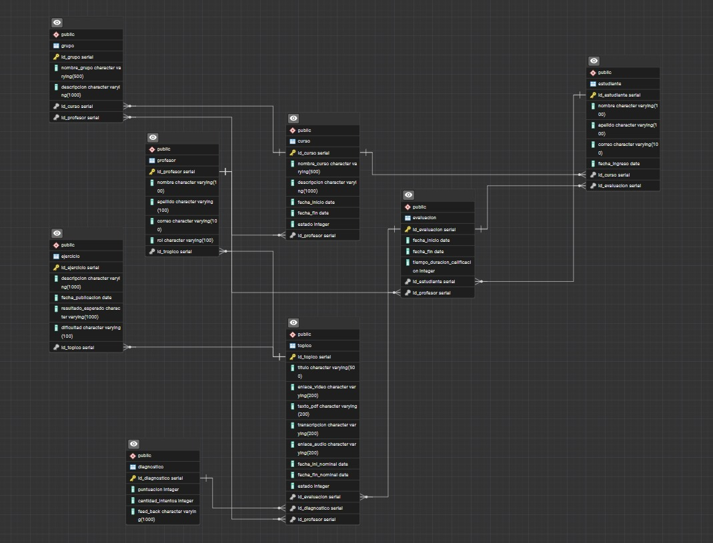
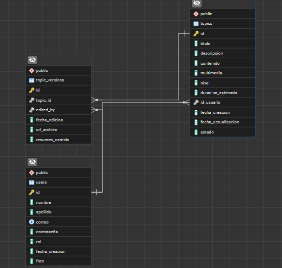

# ForceStack-Repository
# README – Sistema de Aprendizaje de Python

## Descripción del Proyecto
Este proyecto corresponde a la materia **Generación de Software** y consiste en el desarrollo de un **sistema de aprendizaje en línea exclusivo para Python**, inspirado en plataformas educativas como *Platzi*.  

El sistema permite a **estudiantes** acceder a tópicos organizados en módulos, practicar con recursos interactivos y evaluaciones, y avanzar de nivel conforme superan checkpoints diagnósticos. En caso de no aprobar, el estudiante deberá repetir la lección correspondiente hasta dominarla.  

Por otro lado, los **docentes** pueden crear y gestionar tópicos, materiales y evaluaciones, además de monitorear el desempeño de los estudiantes a través de reportes y métricas.

---

## Objetivos
- Proveer una plataforma de aprendizaje estructurada y progresiva.  
- Facilitar la enseñanza de Python a través de contenidos breves y laboratorios prácticos.  
- Asegurar que los estudiantes dominen cada tema antes de avanzar.  
- Permitir a los docentes evaluar y reforzar las áreas donde los estudiantes presentan más dificultades.  

---

## Requerimientos Funcionales
- Registro y autenticación de estudiantes y docentes.  
- Creación, edición y eliminación de tópicos por parte de los docentes.  
- Acceso a contenidos en distintos formatos: texto, imágenes, videos (máx. 10 minutos), slides y audios.  
- Evaluaciones y checkpoints diagnósticos por tópico.  
- Repetición obligatoria de lecciones en caso de no aprobar el diagnóstico.  
- Notificaciones automáticas de tareas pendientes.  

---

## Arquitectura – Modelo C4

### Nivel 1: Contexto
A continuación se muestra el **Diagrama de Contexto (C1)**, donde se identifican los actores principales (Profesor y Estudiante), el sistema de aprendizaje y los sistemas externos con los que interactúa (correo electrónico, calendario y sistema académico).  

  

**Descripción:**  
- **Profesor:** crea tópicos, evalúa y supervisa el desempeño.  
- **Estudiante:** accede a lecciones, realiza ejercicios y evaluaciones.  
- **Sistema de Aprendizaje de Python:** gestiona contenidos, progresión y notificaciones.  
- **Sistemas externos:** correo y calendario (notificaciones), sistema académico (información de estudiantes y docentes).  

---

## Modelo de Base de Datos
El modelo de datos incluye las principales entidades del sistema: **Usuarios (estudiantes, profesores), Cursos, Tópicos, Evaluaciones, Ejercicios y Diagnósticos**.  

### Modelo de Base de Datos Inicial 
Este fue la base datos inicial propuesta:
  

### Modelo de Base de Datos Actual 
Esta es la base de datos con la que se decidio trabajar 
  

**Descripción:**  
- **Estudiante / Profesor:** entidades principales de usuarios con sus credenciales y roles.  
- **Curso:** organiza grupos y tópicos.  
- **Tópico:** contiene recursos educativos (texto, imágenes, videos, audios, transcripts).  
- **Ejercicio / Diagnóstico:** permiten evaluar el aprendizaje, registrar intentos y resultados.  
- **Evaluación:** valida el progreso del estudiante a nivel de módulo/curso.  

---

## Tecnologías Propuestas
- **Frontend:** JavaScript (HTML, CSS)  
- **Backend:** Node.js + Express  
- **Base de Datos:** PostgreSQL  
- **Ejecución de código:** contenedores Docker aislados  
- **Notificaciones:** integración con servicios de correo (SMTP / Gmail API) 

---

## Estado del Proyecto
Actualmente se cuenta con:  
- Definición de requisitos.  
- Modelo C4 (hasta nivel 1 – Contexto).  
- Modelo entidad–relación de la base de datos.  

Próximos pasos:  
- Diseño de contenedores (C2) y componentes (C3).  
- Implementación inicial del sistema (MVP).  
